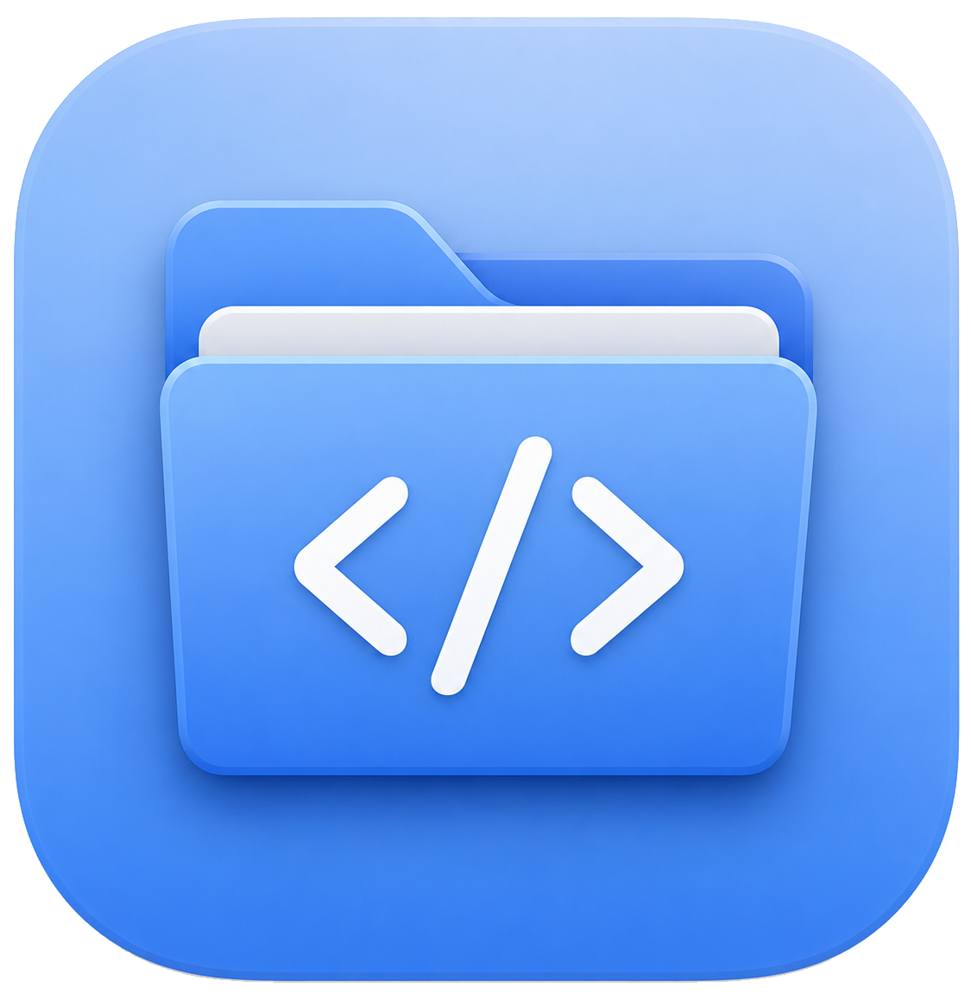
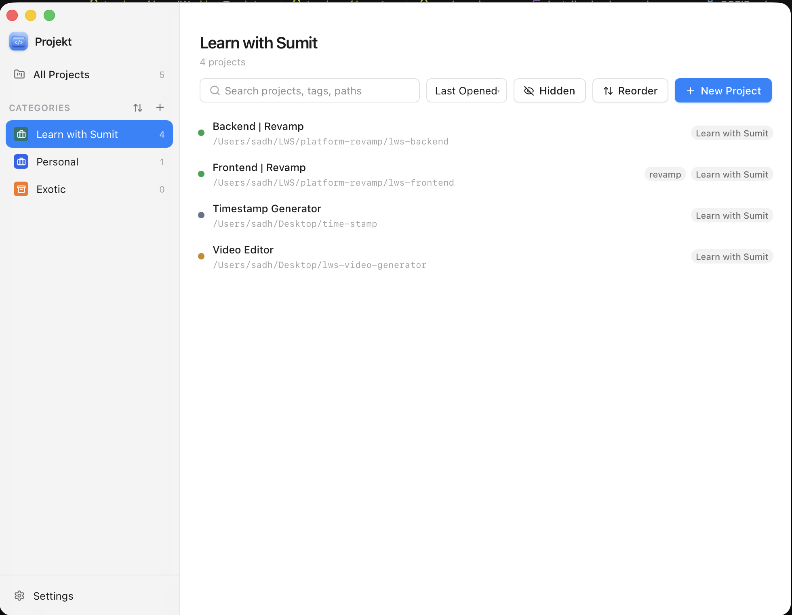
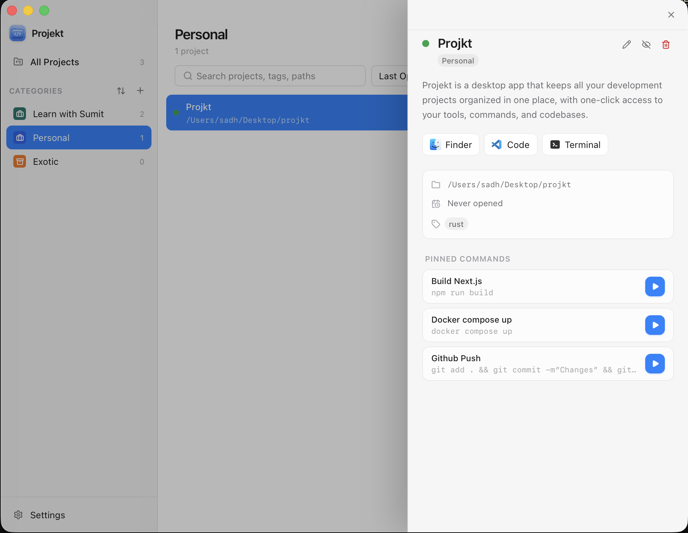

<p align="center">
  
</p>

<h1 align="center">Projekt</h1>

<p align="center">
  A focused macOS desktop app for organizing local development projects, launchers, commands, and workspaces in one place.
</p>

<p align="center">
  
  
  
  
  
</p>

<p align="center">
  
  
  
</p>

---

## Overview

Projekt is built for developers who jump between many local codebases every day. Instead of remembering folders, terminal commands, app launchers, and project context manually, Projekt gives you a clean native desktop workspace for the whole loop:

Add a folder, organize it, then open it in Finder, VS Code, Terminal, or your own custom launcher with one click.

## Screenshots

### Project Workspace



### Project Details



## Features

- Project registry for local folders with name, description, path, tags, category, color, and pinned commands.
- Category-based organization with Lucide icons, colors, hidden states, and project counts.
- Fast project search across names, descriptions, paths, tags, and category names.
- Built-in actions for Finder, VS Code, and Terminal.
- Custom macOS app launchers for additional `.app` targets.
- Reusable command templates that can be pinned to projects and run from the detail panel.
- Smart terminal execution for project commands.
- Manual reordering, hidden projects, and last-opened sorting.
- Local-first persistence with SQLite. No sync, no cloud, no account.

## Tech Stack

| Layer | Technology |
| --- | --- |
| Desktop shell | Tauri v2 |
| Frontend | React 19, TypeScript, Vite |
| Styling | Tailwind CSS v4 |
| UI primitives | Radix UI |
| State | Zustand, TanStack Query |
| Backend | Rust |
| Database | SQLite with `rusqlite` |
| Icons | Lucide React |

## Getting Started

### Prerequisites

- Node.js
- Rust
- macOS for the current desktop build workflow
- Xcode Command Line Tools on macOS

Install dependencies:

```sh
npm install
```

Run the web app:

```sh
npm run dev
```

Run the desktop app:

```sh
npm run tauri:dev
```

## Build

Build the frontend:

```sh
npm run build
```

Build the desktop app:

```sh
npm run tauri:build
```

Build an Apple Silicon DMG:

```sh
npm run tauri build -- --target aarch64-apple-darwin --bundles dmg
```

The generated macOS release artifact is written to:

```txt
src-tauri/target/aarch64-apple-darwin/release/bundle/dmg/
```

## Project Structure

```txt
src/
  components/      React UI grouped by feature
  hooks/           React Query and UI behavior hooks
  lib/             API wrappers, helpers, and shared types
  store/           Zustand UI state

src-tauri/
  src/commands/    Tauri commands for projects, categories, launchers, shell actions
  src/db/          SQLite connection and migrations
  src/models/      Rust data models
  tauri.conf.json  Desktop app and bundle configuration
```

## Roadmap

- Better command editing workflows.
- Launcher reordering.
- Category drag reordering.
- Expanded cross-platform launcher support.
- Signed and notarized release pipeline.

## Contributing

Contributions are welcome. Keep changes focused, preserve the native macOS feel, and prefer simple, reusable modules over large mixed-purpose files.

Before opening a pull request:

```sh
npm run build
cd src-tauri
cargo check
```

## License

Add a license before publishing this repository publicly.
